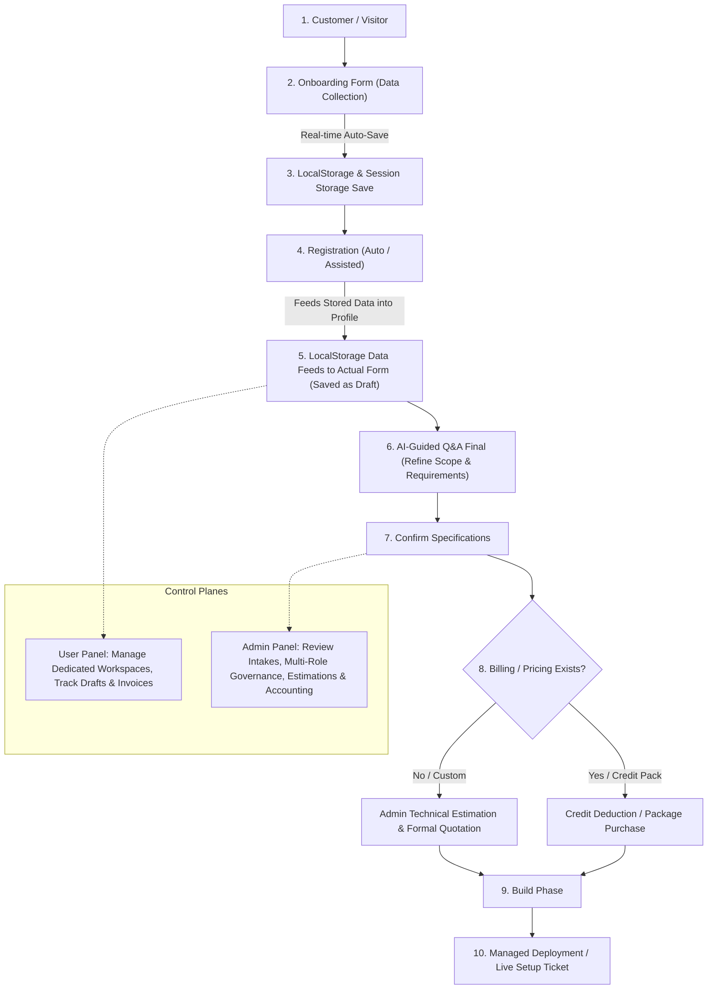

# DUDOS Master Implementation Plan & Work Roadmap

**Lead Developer**: Shakil Khan  
**Project**: DUDOS — Web Development Platform & Automation of Web & E-Commerce Limited  
**Timeline**: 4 Working Days (27th Sep 2026 – 30th Sep 2026)  
**Target Completion**: 30th September 2026  
**Architecture**: Next.js 16 Frontend (Static & Local/SessionStorage First) + FastAPI Backend Integration  

---

## 📌 Executive Summary & Scope of Work

Based on the official DUDOS Platform & ERP specification (Daffodil Web & E-Commerce Limited), this implementation plan coordinates the full stack delivery within **4 Working Days by 30th Sep 2026**.

### Core Constraints & Directives:
1. **Frontend-First & Static-First**: The frontend does not rely on Next.js internal server API routes (`app/api`). All client state, pre-registration drafts, forms, credits, and project records persist in `localStorage` and `sessionStorage`.
2. **FastAPI Backend Planned & Decoupled**: The backend APIs (Auth, Order, Builder, Estimation) are developed in FastAPI by Shakil Khan and mapped directly via clean TypeScript interface contracts for seamless final integration on 30th Sep 2026.
3. **Strict UI & Design Integrity**: 100% adherence to the existing DUDOS design language (`#112C3A` Navy, `#087F79` Teal, `#53D3BD` Accent Mint, Google Inter/Outfit typography, zero broken layouts, bilingual EN/BN support).
4. **Step-by-Step Approval**: No advance implementation is executed without explicit user review and go-ahead per phase.

## 🔄 Official User & Business Lifecycle Flow



---

## 🗓️ 4-Working-Day Schedule & Milestones (27 Sep – 30 Sep 2026)

**Lead Developer**: Shakil Khan (@mdshakilkhan841)  
**Target Completion**: 30th September 2026  

| Day | Date | Milestones & Deliverables | Status |
|---|---|---|---|
| **Day 1** | **27 Sep 2026** | • Customer Onboarding Form & Data Collection.<br>• Real-time `localStorage`/`sessionStorage` draft save.<br>• Registration & Login forms feeding pre-registration data.<br>• Data feed to actual form to save as active draft. | 🟢 **Completed** |
| **Day 2** | **28 Sep 2026** | • Dedicated **Customer User Panel** & Workspace Overview.<br>• Active Draft Feed from `localStorage` (`dudos_active_draft`).<br>• Interactive **AI-Guided Q&A Final** module (refine & recalibrate scope).<br>• Confirmation step & Autonomous SRS generation / export. | 🟢 **Completed** |
| **Day 3** | **29 Sep 2026** | • Billing & Invoicing Gate (Credit packages, wallet balance & quotations).<br>• Build & Deploy phase transition (managed deployment ticket).<br>• Dedicated **Admin Panel** live estimation review & quotation dispatch. | 🟢 **Completed** |
| **Day 4** | **30 Sep 2026** | • End-to-end flow verification (Customer -> Onboarding -> Register -> Draft -> QA -> Confirm -> Billing -> Deploy).<br>• FastAPI Backend integration bridge (`NEXT_PUBLIC_USE_BACKEND_API`).<br>• Final review, testing & handoff. | ⚪ **Next Phase** |

---

## 🔌 FastAPI Backend API Implementation Plan

This section provides the complete blueprint for the **FastAPI Python Backend** being developed by Shakil Khan, designed to integrate with the Next.js frontend by **30th Sep 2026**.

### 1. Technology Stack & Architecture
- **Framework**: FastAPI (Python 3.11+) with Async/Await endpoints
- **Data Validation & Serialization**: Pydantic v2
- **Database & ORM**: PostgreSQL with SQLAlchemy 2.0 (Async) + Alembic migrations
- **Authentication**: JWT Bearer Tokens (`python-jose`) + Argon2/Bcrypt password hashing (`passlib`)
- **CORS**: `CORSMiddleware` configured for `http://localhost:3000` (Next.js development) and production origin
- **API Base Path**: `/api/v1`

### 2. Backend Project Directory Structure
```
backend/
├── app/
│   ├── main.py                     # FastAPI application factory, CORS, router mounting
│   ├── core/
│   │   ├── config.py               # Pydantic BaseSettings (SECRET_KEY, DATABASE_URL, etc.)
│   │   ├── security.py             # create_access_token, verify_password, get_password_hash
│   │   └── database.py             # AsyncSession, create_async_engine
│   ├── dependencies/
│   │   ├── auth.py                 # get_current_user, require_role(["admin", "client"])
│   │   └── db.py                   # get_db session dependency
│   ├── models/                     # SQLAlchemy Models
│   │   ├── user.py                 # User, Role, PreRegDraft
│   │   ├── workspace.py            # Workspace, WorkspaceMember
│   │   ├── credit.py               # CreditWallet, CreditTransaction
│   │   ├── project.py              # CustomProject, ProjectComment, DeploymentTicket
│   │   ├── quotation.py            # QuotationInvoice, ManHoursBreakdown
│   │   └── audit.py                # DownloadLog, ActivityEvent
│   ├── schemas/                    # Pydantic v2 Request & Response Schemas
│   │   ├── auth.py                 # UserCreate, UserLogin, TokenResponse, UserProfileOut
│   │   ├── builder.py              # SrsGenerateRequest, SrsResponse, WebsiteBuildRequest
│   │   ├── credit.py               # CreditBalanceOut, CreditPurchaseRequest, CreditDeductRequest
│   │   ├── project.py              # ProjectCreate, ProjectOut, FeedbackCreate, TicketCreate
│   │   ├── quotation.py            # QuotationCreate, QuotationOut, QuotationAcceptRequest
│   │   └── erp.py                  # ErpMetricsOut, DownloadLogOut
│   ├── api/
│   │   └── v1/
│   │       ├── api_router.py       # Main v1 APIRouter aggregator
│   │       └── endpoints/
│   │           ├── auth.py         # Registration, Login, Current User, Drafts
│   │           ├── builder.py      # AI SRS generator, website code build & download
│   │           ├── credits.py      # Wallet balance, transactions, top-up purchase
│   │           ├── projects.py     # Custom project submission, listing, feedback
│   │           ├── quotations.py   # Admin estimation, auto-quotation, client acceptance
│   │           └── erp.py          # Mini ERP sales figures, accounting, audit logs
│   └── services/
│       ├── ai_srs_service.py       # Heuristic/LLM SRS generation logic
│       ├── estimation_engine.py    # Man-hours, rate & profit margin calculation
│       └── package_compiler.py     # Source ZIP generation & database schema bundling
└── requirements.txt
```

---

### 3. Comprehensive API Endpoints Specification

#### 📦 Module 1: Authentication & User Roles (`/api/v1/auth`)

| Method | Endpoint | Description | Auth Required | Request Body / Params | Response |
|:---|:---|:---|:---:|:---|:---|
| **POST** | `/api/v1/auth/register` | Register new user with username & role; automatically seeds 1,000 credits | None | `{ email, username, password, role, displayName, organizationName?, identifier?, department? }` | `{ user: UserProfile, token: { access_token, token_type } }` (201 Created) |
| **POST** | `/api/v1/auth/login` | Authenticate with username OR email & password | None | `{ identifier, password }` (identifier = email or username) | `{ user: UserProfile, token: { access_token, token_type } }` (200 OK) |
| **GET** | `/api/v1/auth/me` | Retrieve profile, active role, permissions & credit balance of current user | Bearer JWT | None | `UserProfileOut` (200 OK) |
| **POST** | `/api/v1/auth/pre-registration-draft` | Sync pre-registration draft to backend (cross-device restoration) | None | `{ role, username, email, displayName, draftData: json }` | `{ status: "saved", savedAt: string }` |
| **GET** | `/api/v1/auth/pre-registration-draft` | Fetch saved pre-registration draft by email/session token | None | `?email=user@domain.com` | `{ draft: PreRegistrationDraft }` |

#### 🏢 Module 2: Workspaces (`/api/v1/workspaces`)

| Method | Endpoint | Description | Auth Required | Request Body / Params | Response |
|:---|:---|:---|:---:|:---|:---|
| **GET** | `/api/v1/workspaces` | List all workspaces accessible by the current user | Bearer JWT | None | `{ workspaces: Workspace[] }` |
| **POST** | `/api/v1/workspaces` | Create a new private or team workspace | Bearer JWT | `{ name: string, description?: string }` | `WorkspaceOut` (201 Created) |
| **GET** | `/api/v1/workspaces/{id}` | Retrieve specific workspace with project summaries | Bearer JWT | `id: string` path param | `WorkspaceDetailOut` |

#### ⚡ Module 3: AI Website Builder & Self-Service (`/api/v1/builder`)

| Method | Endpoint | Description | Auth Required | Request Body / Params | Response |
|:---|:---|:---|:---:|:---|:---|
| **GET** | `/api/v1/builder/templates` | List available design templates & layouts (Section 3.2) | Optional | None | `{ templates: TemplateProfile[] }` |
| **POST** | `/api/v1/builder/generate-srs` | Generate structured AI SRS from requirements & reference website URL (deducts 50 credits) | Bearer JWT | `{ projectName, category, brief, referenceUrl?, pages: string[] }` | `{ srsContent: string, creditsRemaining: number }` (200 OK) |
| **POST** | `/api/v1/builder/generate-package` | Compiles source code and database bundle (deducts 100 credits) | Bearer JWT | `{ projectSpec: ProjectJSON }` | `{ downloadId: string, fileCount: number, downloadUrl: string }` |
| **GET** | `/api/v1/builder/download/{downloadId}` | Stream source code ZIP file; logs download audit entry (Section 3.5) | Bearer JWT | `downloadId: string` path param | Binary ZIP Stream |
| **POST** | `/api/v1/builder/deployments/ticket` | Request Managed Deployment Assistance for domain mapping & VPS setup (deducts 200 credits) | Bearer JWT | `{ projectId, domainName, dnsProvider, serverTarget, specialInstructions }` | `{ ticketId: string, status: "pending_tech_review" }` (201 Created) |

#### 💰 Module 4: Credits & Monetization (`/api/v1/credits`)

| Method | Endpoint | Description | Auth Required | Request Body / Params | Response |
|:---|:---|:---|:---:|:---|:---|
| **GET** | `/api/v1/credits/wallet` | Fetch current credit balance and transaction history (Section 3.3) | Bearer JWT | None | `{ balance: number, transactions: CreditTransaction[] }` |
| **GET** | `/api/v1/credits/packages` | List purchasable credit packages (1,000, 5,000, 15,000) | Bearer JWT | None | `{ packages: CreditPackage[] }` |
| **POST** | `/api/v1/credits/purchase` | Purchase credit package via payment gateway simulation | Bearer JWT | `{ packageId: string, paymentMethod: "bKash" \| "Nagad" \| "Card" }` | `{ newBalance: number, transactionId: string }` |
| **POST** | `/api/v1/credits/deduct` | Internal / client credit deduction with idempotency | Bearer JWT | `{ amount: number, reason: string, idempotencyKey: string }` | `{ success: boolean, remaining: number }` |

#### 📁 Module 5: Custom Projects, Auto-Quotation & Orders (`/api/v1/projects` & `/api/v1/quotations`)

| Method | Endpoint | Description | Auth Required | Request Body / Params | Response |
|:---|:---|:---|:---:|:---|:---|
| **POST** | `/api/v1/projects/custom` | Submit custom project request with business scope & reference URL (Section 3.4) | Bearer JWT | `{ title, category, referenceUrl, businessScope, selectedFeatures, framework, budgetRange, srsContent }` | `CustomProjectOut` (201 Created) |
| **GET** | `/api/v1/projects` | List projects (Client gets their own; Admin gets client-wise list with search) | Bearer JWT | Query: `?search=&status=&clientEmail=` | `{ projects: CustomProjectOut[], total: number }` |
| **GET** | `/api/v1/projects/{id}` | Get full project details, specifications and current status | Bearer JWT | `id: string` path param | `CustomProjectDetailOut` |
| **POST** | `/api/v1/projects/{id}/feedback` | Submit client feedback / comments on project progress (Section 3.5) | Bearer JWT | `{ comment: string }` | `ProjectFeedbackOut` (201 Created) |
| **GET** | `/api/v1/projects/{id}/feedback` | Get comment and feedback history for a project | Bearer JWT | `id: string` path param | `{ feedback: ProjectFeedbackOut[] }` |
| **POST** | `/api/v1/quotations/estimate` | Admin Technical Estimation: calculate man-hours, cost & profit margin; dispatch formal quote | Bearer JWT (Admin) | `{ projectId, manHours: { fe, be, qa, devops }, hourlyRate, infraCost, profitMarginPercent }` | `QuotationInvoiceOut` (201 Created) |
| **GET** | `/api/v1/quotations/{id}` | View detailed quotation / invoice breakdown | Bearer JWT | `id: string` path param | `QuotationInvoiceOut` |
| **POST** | `/api/v1/quotations/{id}/accept` | Client accepts quotation; transitions project to approved/in_development and creates Order | Bearer JWT | None | `{ status: "approved", invoiceStatus: "paid", orderId: string }` |

#### 📊 Module 6: Mini ERP Financial & Accounting (`/api/v1/erp`)

| Method | Endpoint | Description | Auth Required | Request Body / Params | Response |
|:---|:---|:---|:---:|:---|:---|
| **GET** | `/api/v1/erp/metrics` | Retrieve ERP figures: Total Sales, Received Payments, Outstanding Balances, Overall Revenue (Section 3.5) | Bearer JWT (Admin) | None | `{ totalSalesBDT, receivedPaymentsBDT, outstandingBalancesBDT, overallRevenueBDT }` |
| **GET** | `/api/v1/erp/invoices` | Dispatched quotations ledger with client and payment status | Bearer JWT (Admin) | Query: `?status=&client=` | `{ invoices: QuotationInvoiceOut[] }` |
| **GET** | `/api/v1/erp/download-audit` | Download logs of source code (user, project, timestamp, file) | Bearer JWT (Admin) | Query: `?page=1&limit=50` | `{ logs: DownloadAuditLogOut[] }` |

---

### 4. Pydantic Models & Contract Definitions

```python
# app/schemas/project.py
from pydantic import BaseModel, HttpUrl, Field
from typing import List, Optional
from datetime import datetime

class ProjectCreate(BaseModel):
    title: str = Field(..., max_length=150)
    category: str
    referenceUrl: Optional[str] = None
    businessScope: str
    selectedFeatures: List[str]
    framework: str
    targetTimeline: str = "4 weeks"
    budgetRange: str
    srsContent: Optional[str] = ""

class ManHoursSchema(BaseModel):
    frontend: int = 40
    backend: int = 60
    qa: int = 20
    devops: int = 15

class EstimationCreate(BaseModel):
    projectId: str
    manHours: ManHoursSchema
    hourlyRate: float = 1200.0  # BDT per hour
    infrastructureCost: float = 15000.0  # BDT
    profitMarginPercent: float = 20.0  # Percentage
```

---

### 5. Frontend Integration Bridge (Day 4 — 30th Sep 2026)

To ensure zero breakage and smooth transition from Day 1-3 static/storage mode to live FastAPI mode:
- A unified API client layer in Next.js (`lib/api-client.ts`) is configured with an environment flag:
  ```env
  NEXT_PUBLIC_API_URL=http://localhost:8000/api/v1
  NEXT_PUBLIC_USE_BACKEND_API=false  # Toggle to true on 30th Sep 2026
  ```
- When `NEXT_PUBLIC_USE_BACKEND_API=false`, calls read/write seamlessly to `localStorage` / `sessionStorage`.
- When set to `true`, calls automatically route to the live FastAPI endpoints using standard `fetch` with JWT Bearer tokens.

---

## 🏗️ Detailed Phase-by-Phase Plan

---

### 🟢 Phase 1 (Day 1 — 27th Sep 2026): Roles, Data Collection Forms & Storage
*Status: Ready for Verification*

#### Objectives:
Establish multi-role authentication, pre-registration form data collection, automatic draft saving to session and local storage, and the complete FastAPI backend architecture specification.

#### Key Deliverables:
- [x] **1.1 Role Matrix & Schema (`types/auth.ts`)**:
  - **Customer / Client**: Workspace management, self-service AI builder, credit balance, custom project requests, and quotation tracking.
  - **System Administrator / Tech Team**: Technical estimation, man-hours breakdown, deployment support, code download audit, and ERP accounting.
  - Additional enterprise roles supported: Merchant/Vendor, Partner/Agency, Academy/Student, Executive.
- [x] **1.2 Pre-Registration Storage System (`context/auth-context.tsx`)**:
  - Dual-layer saving (`sessionStorage` for active browser session + `localStorage` for cross-tab persistence).
  - Autosaves every form field in real-time as the user types (username, email, organization, identifier, department, role).
  - Draft restoration banner on reload with a 1-click "Clear Draft" reset button.
- [x] **1.3 Login & Registration Forms (`components/auth/`)**:
  - `RegisterForm.tsx`: Username field with `@` validation, 1,000 credit welcome pack notification, and draft recovery notice.
  - `LoginForm.tsx`: Unified login by either username or email, remember-me toggle, and instant demo credentials.
  - `StakeholderSelector.tsx`: Visual selector for switching between Customer/Client and Admin/Tech Team.
- [x] **1.4 FastAPI Architecture & Endpoint Specification**:
  - Full API endpoints, Pydantic schemas, and module directory structure defined above.

---

### 🟡 Phase 2 (Day 2 — 28th Sep 2026): Builder, AI SRS Generator & Credits
*Status: Planned — Awaiting Confirmation to Proceed*

#### Objectives (PDF Section 3.2 & 3.3):
Empower users to build websites self-service, input requirements, generate AI SRS specifications, supply external website reference URLs to replicate designs, and manage credits.

#### Key Deliverables:
- [ ] **2.1 Requirements Input & AI SRS Generator**:
  - Textarea and file upload for business requirements.
  - One-click **"Generate AI SRS"** engine that creates structured Markdown software requirement specifications (Objectives, Tech Stack, Modules, Acceptance Criteria).
- [ ] **2.2 Template & Reference URL Selection**:
  - Add input field for **External Website Reference URL** (e.g. replicating design/layout of a competitor or target site as per Section 3.2).
  - Visual selector for pre-designed DUDOS template library.
- [ ] **2.3 Credit & Monetization System (PDF Section 3.3)**:
  - Default welcome package: 1,000 free builder credits on registration.
  - Deduction rules:
    - AI SRS generation: -50 credits.
    - Full website source code generation: -100 credits.
    - Managed deployment assistance ticket: -200 credits.
  - `CreditWalletModal`: Balance display, transaction history log, and top-up packages (1,000 credits - ৳1,500; 5,000 credits - ৳6,000; 15,000 credits - ৳15,000).
- [ ] **2.4 Self-Download vs Managed Deployment (PDF Section 3.2)**:
  - Instant self-download ZIP of source code and database schema.
  - "Request Managed Deployment Assistance" ticket modal (domain name, DNS provider, hosting target) notifying the tech team.

---

### ⚪ Phase 3 (Day 3 — 29th Sep 2026): Custom Projects, Estimation & Mini ERP
*Status: Planned*

#### Objectives (PDF Section 3.4 & 3.5):
Build the workflow for clients who prefer custom enterprise development rather than self-service, complete with admin technical estimation, auto-quotation, and ERP accounting.

#### Key Deliverables:
- [ ] **3.1 Custom Project Submission Form (`CustomProjectForm.tsx`)**:
  - Form fields: Project Title, Category, Reference Website URL, Business Scope, Feature Checklist, Framework Preference (Next.js+FastAPI, React+PostgreSQL, Laravel, etc.), Budget Range, and Timeline.
  - Real-time autosave to `localStorage` (`dudos_custom_project_draft`).
  - Integrated AI SRS button for automatic scope generation.
- [ ] **3.2 Admin Technical Estimation & Billing Modal (`AdminEstimationModal.tsx`)**:
  - Designed for System Administrator / Tech Team.
  - Man-hours estimation breakdown: Frontend hours, Backend hours, QA testing hours, DevOps hours.
  - Calculation engine:
    $$\text{Labor Cost} = \text{Total Hours} \times \text{Hourly Rate}$$
    $$\text{Subtotal} = \text{Labor Cost} + \text{Infrastructure Cost}$$
    $$\text{Grand Total (BDT)} = \text{Subtotal} \times (1 + \text{Profit Margin \%})$$
  - Automated Quotation Dispatch to client workspace and registered email.
- [ ] **3.3 Financial & Accounting Mini ERP Module (PDF Section 3.5)**:
  - KPI metric cards:
    - **Total Sales Figures** (total sum of dispatched quotations)
    - **Received Payments** (paid invoices)
    - **Outstanding Balances** (pending quotations)
    - **Overall Revenue**
  - Invoice breakdown table with status tracking (`dispatched`, `paid`, `cancelled`).

---

### ⚪ Phase 4 (Day 4 — 30th Sep 2026): Dashboards, FastAPI Sync & QA
*Status: Planned*

#### Objectives (Deadline: 30th Sep 2026):
Deliver unified role-aware project dashboards for both Client and Admin, finalize FastAPI backend integration contracts, and execute comprehensive QA.

#### Key Deliverables:
- [ ] **4.1 Client Project Dashboard (PDF Section 3.5)**:
  - View all client projects with live status badges (`submitted`, `in_estimation`, `quoted`, `approved`, `completed`).
  - Code download button with download audit logging.
  - Review formal quotations with 1-click "Accept & Pay" simulation.
  - Submit comments / feedback on projects with instant chronological display.
- [ ] **4.2 Admin Project Dashboard (PDF Section 3.5)**:
  - Client-wise search filter (by email, name, project title, or ID).
  - Status filter dropdown.
  - Action trigger to conduct technical estimation & dispatch quotes.
  - Code download audit trail.
  - Client feedback management.
- [ ] **4.3 FastAPI Backend API Integration Execution**:
  - Connect Next.js frontend with live FastAPI backend endpoints via `lib/api-client.ts`.
  - Validate end-to-end token authentication, custom project creation, quotation dispatch, and credit deductions against real FastAPI server.
- [ ] **4.4 Final Bilingual Verification & End-to-End QA**:
  - Full check of English and Bengali translations across all new forms and views.
  - Complete regression test of navigation and responsive mobile layouts.

---

## 📋 Task Checklist & Tracking Table

| ID | Task Description | Target Day | Assigned To | Status |
|:---|:---|:---:|:---:|:---:|
| **T-01** | User Roles (`client` vs `admin`) & Schema in `types/auth.ts` | Day 1 (Sep 27) | Shakil Khan | 🟢 Complete |
| **T-02** | Pre-registration Draft autosave/restore in session & local storage | Day 1 (Sep 27) | Shakil Khan | 🟢 Complete |
| **T-03** | Login & Register form UI updates with username support & welcome credits | Day 1 (Sep 27) | Shakil Khan | 🟢 Complete |
| **T-04** | Complete FastAPI Backend API Architecture & Endpoints Specification | Day 1 (Sep 27) | Shakil Khan | 🟢 Complete |
| **T-05** | Credit Wallet Modal & Credit deduction economics (1,000 credit package) | Day 2 (Sep 28) | Shakil Khan | 🟢 Complete |
| **T-06** | Website Builder external reference URL input & AI SRS generator | Day 2 (Sep 28) | Shakil Khan | 🟢 Complete |
| **T-07** | Managed Deployment assistance ticket modal | Day 2 (Sep 28) | Shakil Khan | 🟢 Complete |
| **T-08** | Custom Project Submission form with feature selection & scope gathering | Day 3 (Sep 29) | Shakil Khan | 🟡 Next Up |
| **T-09** | Admin Technical Estimation tool with man-hours, cost & profit margins | Day 3 (Sep 29) | Shakil Khan | ⚪ Pending |
| **T-10** | Mini ERP Financial & Accounting module (Sales, Received, Outstanding, Revenue) | Day 3 (Sep 29) | Shakil Khan | ⚪ Pending |
| **T-11** | Unified Client & Admin Project Dashboard | Day 4 (Sep 30) | Shakil Khan | ⚪ Pending |
| **T-12** | FastAPI backend API live integration (Auth, Orders, Builder) | Day 4 (Sep 30) | Shakil Khan | ⚪ Pending |
| **T-13** | Bilingual (EN/BN) verification, mobile responsiveness & final review | Day 4 (Sep 30) | Shakil Khan | ⚪ Pending |

---

## 🚦 Next Step & How We Proceed
We are paused at **Day 1 verification**.  
Please review this updated plan with the complete FastAPI API implementation specifications. Tell us which exact task or step you would like to inspect, modify, or execute next!
