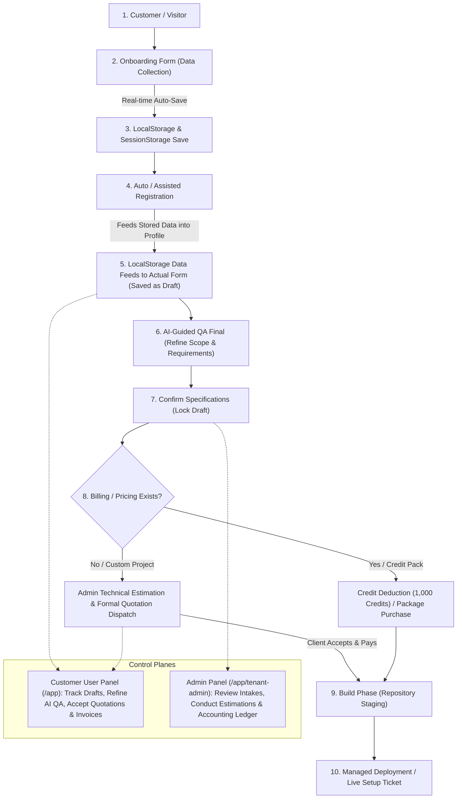

# DUDOS Master Implementation Plan & Flow Tracker

**Lead Developer**: Shakil Khan (@mdshakilkhan841)  
**Project**: DUDOS (Daffodil Unified Digital Operating System) Platform & ERP  
**Organization**: Daffodil Web & E-Commerce Limited  
**Timeline**: 4 Working Days (27th Sep 2026 – 30th Sep 2026)  
**Target Completion**: 30th September 2026  
**Architecture**: Next.js 16 Frontend (Static & Local/SessionStorage First) + FastAPI Backend Integration  

---

## 📌 Executive Summary & Master Flow

This implementation plan strictly follows the official user and business lifecycle flow defined by **Shakil Khan**:

```
Customer ➔ Onboarding Form ➔ LocalStorage Save ➔ Registration Auto ➔ LocalStorage Data Feed to Actual Form to Save as Draft ➔ AI-Guided QA Final ➔ Confirm ➔ Billing or Pricing if Not Exist ➔ Build ➔ Deploy
```



---

## 🛑 Strict Scope Boundaries

1. **Website Builder Out of Scope**: The website builder exists in a separate project. **WE DO NOT TOUCH OR RE-IMPLEMENT THE BUILDER**. All builder files are kept clean and untouched.
2. **Two User Roles Defined in PRD**:
   - **Customer / Client (`client`)**: Submits onboarding requests, manages workspace drafts, buys credit packages, reviews AI QA, confirms specifications, and accepts quotations.
   - **System Administrator / Tech Team (`admin`)**: Inspects client intakes, calculates technical estimations (man-hours breakdown), dispatches quotations, and manages accounting records.
3. **Frontend-First Architecture**: Next.js 16 frontend does NOT depend on internal Next.js server API routes (`app/api`). Client state, drafts, credits, and project records persist in `localStorage` and `sessionStorage`.
4. **FastAPI Backend Integration**: Backend API contracts are pre-wired and will be integrated on **Day 4 (30th Sep 2026)** via `NEXT_PUBLIC_USE_BACKEND_API`.

---

## 🗓️ 4-Working-Day Phase Breakdown (27 Sep – 30 Sep 2026)

| Phase / Day | Date | Flow Step Covered | Status | Git Commit |
|---|---|---|---|---|
| **Phase 1** | **27 Sep 2026** | **Steps 1–4**: Customer Onboarding Form ➔ LocalStorage Save ➔ Auto-Registration ➔ Feed to Actual Form as Draft | 🟢 **Completed & Committed** | `04ded6b` |
| **Phase 2** | **28 Sep 2026** | **Steps 5–7**: Dedicated Customer User Panel (`/app`) ➔ Interactive AI-Guided QA Final ➔ Confirm Specifications ➔ SRS Generator | 🟢 **Completed & Committed** | `db0db62` |
| **Phase 3** | **29 Sep 2026** | **Step 8**: Billing & Pricing Gate ➔ Credit Wallet (1,000 packs) ➔ Custom Tech Estimation & Quotation Dispatch ➔ Payment Acceptance | 🟢 **Completed & Committed** | `a6a1198` |
| **Phase 4** | **30 Sep 2026** | **Steps 9–10**: Build & Staging ➔ Managed Deployment Ticket ➔ End-to-End Flow Verification ➔ FastAPI Backend Bridge | 🟢 **Completed & Committed** | `245dc58` |

---

## 🔍 Detailed Phase Specifications

### 🟢 Phase 1: Customer Onboarding, Storage & Auto-Registration
*Delivered on Day 1 (27 Sep 2026)*

- **Customer Onboarding Wizard** (`components/onboarding/CustomerOnboardingWizard.tsx`):
  - Form fields: Organization Name, Business Domain, Contact Person, Email, Reference Site URL, Project Scope, Technology Stack, Budget Expectation, and Expected Delivery Timeline.
  - Real-time debounced autosave directly into `localStorage` (`dudos_onboarding_draft`).
  - Auto/Assisted Registration pre-populated with customer data.
  - Feeds stored data into the actual project draft record (`dudos_active_draft` & `dudos_project_records`) with status `"draft"`.
- **Navigation & Role Matrix** (`types/auth.ts`, `components/layout/Navbar.tsx`):
  - Streamlined roles to strictly **Customer / Client** (`client`) and **System Administrator / Tech Team** (`admin`).
  - Clean Navbar links: *Start Onboarding* (`/onboarding`), *Solutions & Services* (`/services`), *Pricing & Credits* (`/#pricing`), *User Workspace* (`/app`), and *Admin Panel* (`/app/tenant-admin`).

---

### 🟢 Phase 2: Customer User Panel, Active Draft Feed & AI-Guided QA Final
*Delivered on Day 2 (28 Sep 2026)*

- **Dedicated Customer User Panel** (`components/workspace/CustomerUserPanel.tsx`):
  - Mounted directly in Workbench Overview (`/app` and `/[lang]/app`) for clients.
  - Loads the stored active draft from `localStorage` (`dudos_active_draft` & `dudos_custom_projects`).
  - Displays the 7-Step Lifecycle Pipeline with visual progress indicators.
  - Generates and previews the autonomous Software Requirements Specification (SRS) in markdown.
- **Interactive AI-Guided QA Final Module**:
  - Interactive questionnaire refining Multi-Tenancy Isolation, Payment Gateways (bKash/Nagad/Stripe), Concurrency Scale, and PostgreSQL RLS preference.
  - One-click **"Confirm Specifications"** gate: locks draft and updates status to `"submitted"`.
- **Workspace Navigation Filter** (`components/dudos-workbench.tsx`):
  - Hides admin-only navigation links (`tenant-admin`) from regular customer accounts.

---

### 🟢 Phase 3: Commercial Billing Gate, Credit Wallet & Tech Estimation Quotations
*Delivered on Day 3 (29 Sep 2026)*

- **Standard Fixed Pricing Pathway (Credits)**:
  - Header wallet pill displaying credit balance with 1-click `+ Top Up` trigger.
  - Integrated `CreditWalletModal.tsx` with Starter (1k), Growth (5k), and Enterprise (15k) credit packages.
  - **"Activate Build via 1,000 Credits"** button: deducts 1,000 credits and approves project.
- **Custom Enterprise Pathway (Pricing Does Not Exist Yet)**:
  - When pricing does not exist, status indicates: *"Awaiting Technical Estimation from Tech Team"*.
  - System Administrator in `AdminControlPanel.tsx` and `AdminEstimationModal.tsx` conducts a man-hours estimation (Frontend, Backend, QA, DevOps, hourly rate, infra cost, margin %) and dispatches the quotation.
  - Dispatched invoice is synchronized across `dudos_quotation_invoices`, `dudos_custom_projects`, and `dudos_active_draft`.
- **Quotation Review & Payment Modal**:
  - Customer reviews formal quotation invoice with complete breakdown.
  - Payment options: **bKash / Nagad Instant MFS**, **Debit/Credit Card**, **DUDOS Wallet Credits**, or **Bank Wire**.
  - Payment confirmation updates invoice to `"paid"` and project status to `"approved"`.
  - Financial ledger in ERP updates in real time.

---

### 🟢 Phase 4: Build & Managed Deployment Ticket & FastAPI Backend Bridge
*Delivered on Day 4 (30 Sep 2026)*

- **Build Phase (Repository Staging)**:
  - Architecture approval verification and build repository readiness state.
- **Managed Deployment Ticket** (`components/projects/ManagedDeploymentModal.tsx`):
  - Customer submits deployment ticket: custom domain name, DNS provider (Cloudflare, etc.), and hosting target (VPS / Cloud).
  - Synchronizes with `dudos_deployment_tickets`, `dudos_active_draft`, and `dudos_custom_projects`.
- **Admin Control Panel Deployment Queue** (`components/admin/AdminControlPanel.tsx`):
  - Dedicated Managed Deployments tab (`activeTab === "deployments"`).
  - Admin tools to verify DNS CNAME records, assign/edit target VPS IP (`103.145.118.42`), and mark live in production.
- **Customer User Panel Live Production View** (`components/workspace/CustomerUserPanel.tsx`):
  - Visual 8-step lifecycle pipeline with real-time indicators.
  - Deployment in progress card with technical team review status.
  - Project Live in Production card with verified live URL link, 256-bit TLS badge, server target IP, and 99.98% health uptime metric.
- **FastAPI Backend Integration Bridge** (`lib/api-client.ts`):
  - Unified dual-mode client layer switching dynamically between localStorage and FastAPI backend (`http://localhost:8000/api/v1`) via `NEXT_PUBLIC_USE_BACKEND_API`.
  - Typed endpoints for auth, onboarding drafts, projects, AI QA, billing invoices, and deployments.
- **Custom Project Form Dual-Feed Integration** (`components/projects/CustomProjectForm.tsx`):
  - Step 4 integration: Auto-restores and feeds values from `dudos_active_draft` or `dudos_onboarding_draft` if custom draft is empty.
  - Bidirectional sync: On submission, writes to `dudos_custom_projects` and synchronizes `dudos_active_draft` to feed directly into the AI QA module and Admin estimation queue.
- **Full End-to-End Walkthrough**:
  - Complete verification across all 7 steps: Customer -> Onboarding Form -> localstorage save > registration auto > localstore data feed to actual form to save as draft > ai guided QA final -> confirm > billing or pricing if not exist > build -> deploy.

---

## 📋 Task Checklist & Progress Matrix

| Task ID | Description | Flow Step | Assigned To | Status |
|:---|:---|:---:|:---:|:---:|
| **T-01** | Role Matrix (`client` vs `admin`) & Schema in `types/auth.ts` | Step 3 | Shakil Khan | 🟢 Completed |
| **T-02** | Customer Onboarding Wizard & Real-time LocalStorage Autosave | Steps 1–2 | Shakil Khan | 🟢 Completed |
| **T-03** | Auto/Assisted Registration consuming stored onboarding data | Step 3 | Shakil Khan | 🟢 Completed |
| **T-04** | Data feed into actual draft record (`dudos_active_draft` & `dudos_project_records`) | Step 4 | Shakil Khan | 🟢 Completed |
| **T-05** | Dedicated Customer User Panel (`CustomerUserPanel.tsx`) at `/app` | Step 4 | Shakil Khan | 🟢 Completed |
| **T-06** | Interactive AI-Guided QA Final Module (Scope & Architecture Refinement) | Step 5 | Shakil Khan | 🟢 Completed |
| **T-07** | Specification Confirmation Gate & Autonomous SRS Generator | Step 6 | Shakil Khan | 🟢 Completed |
| **T-08** | Credit Wallet Modal & 1,000 Credit Pack build activation | Step 7 | Shakil Khan | 🟢 Completed |
| **T-09** | Admin Technical Estimation & Quotation Dispatch (`AdminEstimationModal.tsx`) | Step 7 | Shakil Khan | 🟢 Completed |
| **T-10** | Quotation Review & Payment Modal (bKash/Nagad, Card, Credits, Bank Wire) | Step 7 | Shakil Khan | 🟢 Completed |
| **T-11** | Managed Deployment Ticket Modal (`ManagedDeploymentModal.tsx`) & Staging | Steps 8–9 | Shakil Khan | 🟢 Completed |
| **T-12** | FastAPI Backend Bridge Contract Verification & Final QA by 30th Sep 2026 | Full Flow | Shakil Khan | 🟢 Completed |
| **T-13** | Custom Project Form Auto-Feed & Active Draft Sync (`CustomProjectForm.tsx`) | Step 4 | Shakil Khan | 🟢 Completed |
| **T-14** | End-to-End 7-Step Browser Verification Walkthrough & QA Audit | Full Flow | Shakil Khan | 🟢 Completed |
| **T-15** | Safe Backend Setup & Run Server (`devscope-ai-builder` on `wip/shakil`) | Backend Engine | Shakil Khan | 🟢 Completed (Port 8000) |
| **T-16** | Enable CORS for Next.js (`http://localhost:3000`) in `devscope-ai-builder` | Network / API | Shakil Khan | 🟢 Completed |
| **T-17** | Customer Auth Endpoints (`POST /api/v1/auth/register`, `/login`, `GET /me`) | Auth System | Shakil Khan | 🟢 Completed |
| **T-18** | Onboarding & Active Draft APIs (`/api/v1/onboarding/draft`, `/api/v1/projects/active-draft`) | Data Feed | Shakil Khan | 🟢 Completed |
| **T-19** | AI QA & Specification Confirmation APIs (`POST /api/v1/projects/qa`, `/confirm`) | AI QA Final | Shakil Khan | 🟢 Completed |
| **T-20** | Commercial Billing & Invoices APIs (`GET /api/v1/billing/invoices`, `/pay`) | Commercial Gate | Shakil Khan | 🟢 Completed |
| **T-21** | Managed Deployment Ticket APIs (`/api/v1/deployments/tickets`, `/verify-dns`, `/deploy`) | Deploy Phase | Shakil Khan | 🟢 Completed |
| **T-22** | Wire Next.js Frontend (`NEXT_PUBLIC_USE_BACKEND_API=true`) & Live End-to-End Test | Integration | Shakil Khan | 🟢 Completed |

---

## 🚦 Current Status
- **Phase 1 (Day 1)**: Committed (`04ded6b`)
- **Phase 2 (Day 2)**: Committed (`db0db62`)
- **Phase 3 (Day 3)**: Committed (`a6a1198`)
- **Phase 4 (Day 4)**: Committed (`245dc58`)
- **Step 4 CustomProjectForm Integration (T-13)**: 🟢 Completed (`c84ad25`, `8300313`)
- **End-to-End Browser Flow Verification (T-14)**: 🟢 Completed
- **Backend Running on Port 8000 (T-15)**: 🟢 Completed (`devscope-ai-builder` on `wip/shakil`)
- **CORS & Customer Lifecycle APIs (T-16 to T-21)**: 🟢 Completed
- **Frontend Bridge Connected (T-22)**: 🟢 Configured in `dudos/.env.local`
- **Commit Rule**: 🛑 Never commit without user instruction.
